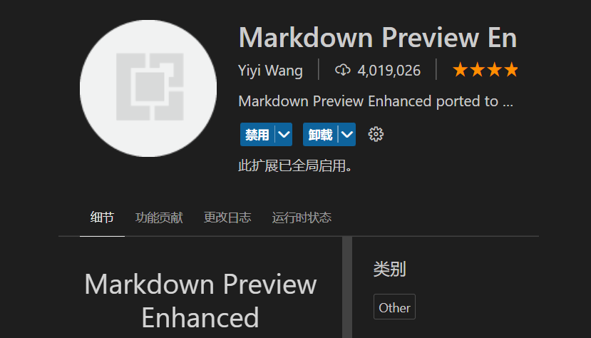

# <center>关于使用VScode编辑MarkDown文件的介绍</center>

一篇文章应该注意的是内容Substance与格式formats。内容是文章的精神，格式是文章的外貌；而好的文章精神饱满、外貌美丽。使用vscode编辑MarkDown是十分方便的，vscode并不是IDE而是一个文件编辑器，配置好可以方便流利的开发。

这里介绍几个vscode的插件
1.MarkDown All in One
支持markdown的快捷键与自动补全操作


2.MarkDown Preview Enhanced
markdown的预览和渲染插件，显示被格式化文章



3.Paste Image
可以方便的把图片插入到markdown文件中


4.LimfxCodeEx
可以快速的把文章发表到limfx（https://limfx.pro）中,在服务上传时自动进行渲染


5.Code Spell Checker
主要进行拼写检查（目前应该只支持英文）


#### MarkDown格式的重要点
          标题  语义  格式
          标题级别 #表示  多少个#代表多少级标题
          换行操作 回车enter 或者 在上一个段落后空格显示
          加粗/斜体/下划线/居中等
          编号功能-自动编号等
          缩进-引用

#### MarkDown复制图片操作
          快捷键Ctrl+Alt+V复制直接在文本编辑中
          格式: 
          图片注释： 格式后空格两个 在需要的注释两边添加*， 如 *这是一个图片注释*

#### MarkDown插入公式
          在公式两边添加$符号， $个数产生的效果是不一样的
          除此以外，插件还自动提供公式补全功能
          $ a^2+b^2=c^2 $显示的效果如下
          
数学公式：$$ a^2+b^2=c^2 $$
在一段文字中 $\lim_{x \to \infin}\frac{sin(t)}{x}=1$ 插入一个公式的效果。

#### 关于MarkDown表格
表格是采用|产生的，在表头和下面一行中加上 "-|" 才能产生表格。在表头下面与内容上的一行两边设置":"代表左右对齐，如果设置两个: 即"::"这个样式代表居中对齐。
格式设置：

渲染的表格效果：
| 表头1 | 表头2 | 表头3 |
| :---: | :---: | :---: |
| test  | test  | test  |
| demo  | demo  | demo  |
表格格式化：选中表格后使用快捷键Alt+shift+f


#### MarkDown插入链接

语法格式：[超链接显示名]与 (超链接地址 "超链接title")拼接
案例：[链接](https://gitee.com/Soketch "/Soketch")

#### 关于MarkDown代码块
采用语法：``` 和 指定语言

c++代码块
```cpp
    #include<iostream>
    int main()
    {
        std::cout<<"hello world"<<std::endl;
        return 0;
    }
```


#### 最后就是导出成pdf文件-发表